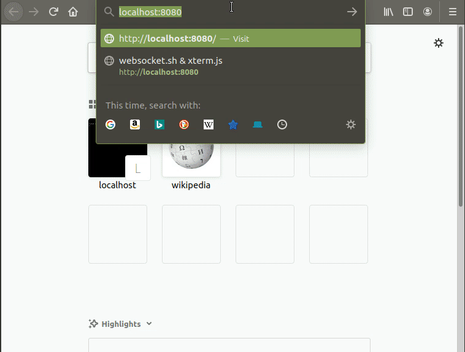

# websocket.sh

Copyright (C) 2016-2025 Anton Skshidlevsky (meefik), MIT

The cross platform [WebSocket](https://tools.ietf.org/html/rfc6455) implementation for UNIX shell.
It works on busybox and ash for embedded systems (requires installing busybox applets).



[See the developer's blog](https://meefik.github.io/2016/08/04/websocket-sh/)

## Install busybox

First of all, you need to install the [busybox binary](https://busybox.net/downloads/binaries/):

```sh
wget -O /bin/busybox https://busybox.net/downloads/binaries/1.35.0-x86_64-linux-musl/busybox
chmod +x /bin/busybox
```

## Shell as a web terminal

Run web server httpd in websocket.sh directory.

For [jquery.terminal](https://terminal.jcubic.pl/):

```sh
cd jquery.terminal
WS_SHELL="busybox sh" busybox httpd -p 8080 -f
```

For [xterm.js](https://xtermjs.org/):

```sh
cd xterm.js
busybox telnetd -p 5023 -l /bin/sh -f ./issue
WS_SHELL="busybox telnet 127.0.0.1 5023" busybox httpd -p 8080 -vv -f
```

Open the terminal in browser: [http://localhost:8080/](http://localhost:8080/)

## Custom usage

Run websocket.sh:

```sh
WS_SHELL="cat" busybox nc -ll -p 5000 -e ./websocket.sh
```

Use from browser:

```js
var wsPort = 5000;
var ws = new WebSocket('ws://' + location.hostname + ':' + wsPort);
ws.onmessage = function(ev) {
  var textDecoder = new TextDecoder();
  var fileReader = new FileReader();
  fileReader.addEventListener('load', function () {
    var str = textDecoder.decode(fileReader.result);
    console.log('Received data: ', str);
  });
  fileReader.readAsArrayBuffer(ev.data);
}
ws.onopen = function() {
  ws.send('hello');
}
```

## Multiple socket connections

You can use busybox inetd for multiple connections to single port for websocket.sh:

```sh
export WS_SHELL="/path/to/script.sh"
busybox inetd -e -f /path/to/inetd.conf
```

The `/path/to/inetd.conf` may look like:

```
5000	stream	tcp	nowait	root	/path/to/websocket.sh
```
